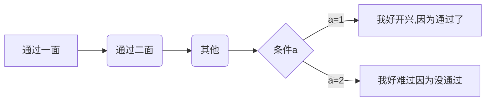

# 我是标题

## 1.***学习git***
- **过程**：从一开始的觉得有些有趣，到中途想要放弃，到最后终于开始写这篇感触的有些开心，心理上的变化恰巧也是我行为上的 <kbd>积极</kbd> ——<kbd>懈怠</kbd>——<kbd> 积极</kbd>。 我有在网站上看教程看一些视频最后还得到一位漂亮姐姐的帮助。（脑补的，但我觉得耐心的人，都很漂亮）

- **经历**：说几个伤心事吧，看到并学习的第一个远古版本的git教程，让我在实际操作中很懵逼，哈哈哈，不过后来证明还是很有用的。还有一个就是我clone的文件打不开，上网搜了一些，但也没搜到，中途我还产生了想放弃的想法，幸好最后还是坚持下来了。还有就是下载typora时下载了个macos的，就很崩溃，最后学长也帮我解决了，哈哈。

- **实践**：在看了一些视频和我自己搜的东西后，就开始一通乱点，每个按键一通乱点，就挨着尝试功能吧。现在也对git github 有了比较好的理解，用git将此文件上传到github。

- **感受**：写完这篇感受后，我觉得很充实，虽然过程中有枯燥，但也有学到知识的开心，解决问题的喜悦。这次的经历也让我更深刻的明白一个道理，世上无难事，只怕有心人。

## 2.***学习Markdown***
- **过程**：还是比较轻松的吧，了解到文档的格式意义后，就对它的作用有了了解上手很快，在菜鸟裹裹上看了教程就差不多了。

- **实践**：就做了一些笔记，然后各种效果自己尝试，比如我发现其实有的符号后面还要打空格才能有效果,然后有的符号必须先切换成英语才打得出来。


- **经历**：比较顺吧感觉比word简单。

- **成果展示**
>Markdown段落格式：空行就行

>Markdown标题：几个星号就是几级标题

>Markdown列表：打这个符号就行 *，混合的第二个空四格

>Markdown区块：打这个符号>

>Markdown链接：【连接名称】(链接地址）比如这是一个链接[github](https://www.github.com/)

>Markdown表格
|左对齐  |右对齐 | 居中对齐 |
| : |:  |  ::  |
|  单元格  |  单元格   |  单元格  |
>Markdown的其他技巧：比如markdown可以符号前面加上/帮助插入普通的符号，还有好多图的格式我没有每一个都弄。举个例子吧，


## 3.***进入程序部之后想学习的东西***
包括网站的制作，让自己制作的网页更精美，还有C语言java啊什么的，，我希望可以的学习知识，交到一些朋友，收获友谊。


冲冲冲！

```

```

```

```